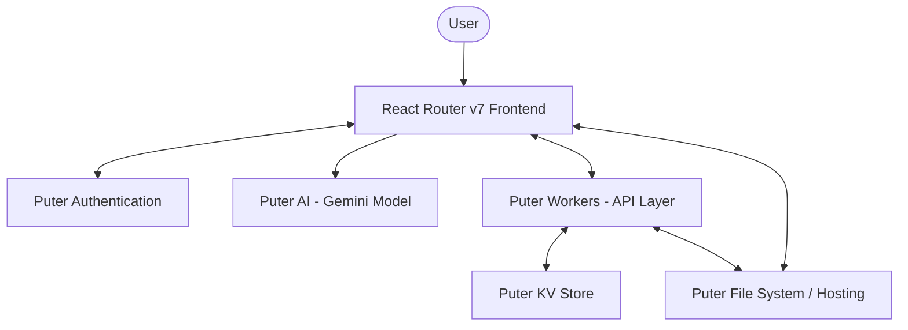

# Roomify

Roomify is an AI-first design environment that allows users to convert 2D floor plans into photorealistic, top-down 3D architectural renders at the speed of thought. It streamlines the visualization process for architects and designers, helping them ship projects faster than ever.

## 🌟 Features

- **Instant 2D to 3D Conversion**: Upload a floor plan (JPG, PNG, WebP) and get a photorealistic 3D render.
- **AI-Powered Visualization**: Uses advanced AI models (Gemini) to extrude walls, doors, and furniture precisely from your plan.
- **Top-Down Architectural View**: Generates crisp, orthographic top-down views for professional-grade architectural visualization.
- **Project History**: Securely save and manage your design projects with built-in authentication.
- **Interactive Comparison**: View before and after transformations using a high-performance image slider.
- **Export & Share**: Easily download your renders and share them with your team or community.

## 🏗️ Architecture

Roomify is built on a modern, serverless architecture leveraging **Puter.js** for infrastructure and **React Router v7** (formerly Remix) for the frontend experience.

### High-Level Architecture Diagram



### Data Flow
1. **Authentication**: Users sign in via Puter's unified authentication.
2. **Project Creation**: Floor plans are uploaded, processed, and stored in Puter's decentralized file system.
3. **AI Rendering**: The application sends the 2D plan to the Puter AI engine, which uses the `gemini-2.5-flash-image-preview` model with a custom architectural prompt.
4. **Storage & Hosting**: Resulting images are hosted via Puter Hosting, and project metadata is managed through Puter Workers and KV storage.

## 🛠️ Technology Stack

- **Frontend**: 
  - [React Router v7](https://reactrouter.com/) (Web Framework)
  - [Tailwind CSS](https://tailwindcss.com/) (Styling)
  - [Lucide React](https://lucide.dev/) (Icons)
  - [React Compare Slider](https://github.com/nerducate/react-compare-slider) (Visual Comparison)
- **Infrastructure (Puter.js)**:
  - **Auth**: Simplified user management.
  - **AI**: Gemini 2.0/2.5 Flash for image-to-image generation.
  - **FS**: Cloud storage for source and rendered images.
  - **Hosting**: Static asset hosting for project files.
  - **Workers**: Serverless backend functions for API logic.
  - **KV**: Configuration and metadata persistence.
- **Runtime**: [Bun](https://bun.sh/) (Fast JavaScript runtime)

## 📁 Project Structure

```text
roomify/
├── app/                  # Main application source
│   ├── routes/           # Page routes (Home, Visualizer, Not Found)
│   ├── root.tsx          # Application entry point and layout
│   └── routes.ts         # Route configuration
├── components/           # Reusable React components (Navbar, Upload, UI)
├── lib/                  # Utility functions and core logic
│   ├── ai.action.ts      # AI generation logic
│   ├── puter.action.ts   # Puter.js integrations (Auth, API)
│   ├── constants.ts      # Shared constants and AI prompts
│   └── utils.ts          # Helper utilities
├── public/               # Static assets
├── package.json          # Dependencies and scripts
└── tsconfig.json         # TypeScript configuration
```

## 🚀 Getting Started

### Prerequisites

- [Bun](https://bun.sh/) installed on your machine.
- A [Puter](https://puter.com/) account for API access.

### Installation

1. Clone the repository:
   ```bash
   git clone https://github.com/your-username/roomify.git
   cd roomify
   ```

2. Install dependencies:
   ```bash
   bun install
   ```

3. Set up environment variables:
   Create a `.env.local` file in the root directory and add your Puter configuration:
   ```env
   VITE_PUTER_WORKER_URL=your_puter_worker_url
   ```

4. Start the development server:
   ```bash
   bun run dev
   ```

## 📄 Built by follow along with the  [JSM MASTERY](https://www.youtube.com/watch?v=JiwTGGGIhDs) Tutorial

---
Built with ❤️ using [Puter](https://puter.com) and [React Router](https://reactrouter.com).
